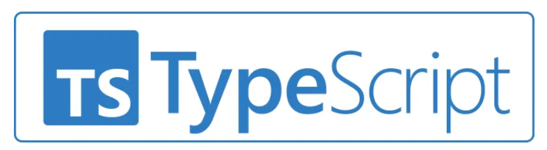
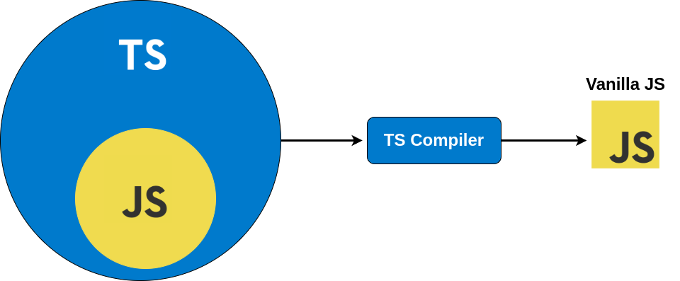

# typescript-workshop

## What is TypeScript?

**[TypeScript](https://www.typescriptlang.org/)** (or **TS**) is a free, open-source programming language created by Microsoft. It builds on JavaScript by adding static typing, which means you can define the types of variables and functions to catch errors early - before your code runs.

TypeScript is especially helpful for building large and complex applications. It doesn’t run directly in browsers or servers, so it needs to be **transformed into JavaScript** first - a process called **transpiling**. You can use the built-in TypeScript Compiler for this, or use tools like [Babel](https://babeljs.io/).

You can write TypeScript for both **front-end (browser)** and **back-end (server)** development, using platforms like [Node.js](https://nodejs.org/en), [Deno](https://deno.com/), or [Bun](https://bun.sh/).

## Handbook
- [TS is a superset of JS](#ts-is-a-superset-of-js)
- [BigInt in TypeScript](#bigint-in-typescript)
- [References](#references)

## Workshops
- [Environment setup for TS projects](./workshops/env-setup/)
- [TS is a superset of JS](./workshops/ts-js-superset/)
- [FreeCodeCamp TS tutorial workshop files](./workshops/freecodecamp-ts/)
- [Object-Oriented Programming in TS](./workshops/oop/)

### TS is a superset of JS 

This means that TypeScript is a programming language that builds on JavaScript by adding extra features, primarily static typing, while still including all of JavaScript's functionality. 

- **Superset**: A superset is a language that encompasses everything in another language (JavaScript, in this case) and extends it with additional capabilities. This means any valid JavaScript code is also valid TypeScript code.
  
- **JavaScript (JS)**: JavaScript is a dynamic, loosely-typed programming language widely used for web development. It doesn't require specifying data types for variables (e.g., `let x = 5` can later become `x = "hello"` without issue).

- **TypeScript (TS)**: TypeScript is an open-source language developed by Microsoft that adds static typing and other features to JavaScript. For example, in TypeScript, you can declare a variable with a specific type, like `let x: number = 5`, and attempting to assign a non-number (e.g., `x = "hello"`) will cause a compile-time error.

- **Key Additions in TypeScript**:
  - **Static Typing**: Developers can define types for variables, function parameters, and return values, catching type-related errors during development.
  - **Interfaces and Generics**: These allow for better structuring and reusability of code.
  - **Advanced Tooling**: Features like autocompletion, type inference, and better IDE support improve development efficiency.
  - **Compile to JavaScript**: TypeScript code is transpiled (converted) into JavaScript before running in browsers or Node.js, ensuring compatibility.

- **Why a Superset?**: Since TypeScript includes all JavaScript syntax and behavior, you can write plain JavaScript in a TypeScript file, and it will work. However, TypeScript's additional features (like types) provide more robust error checking and scalability, especially for large projects.

In short, TypeScript extends JavaScript by adding optional features like static types, making it more powerful for developers while remaining fully compatible with JavaScript.

## References
- [Docs: The TypeScript Handbook](https://www.typescriptlang.org/docs/handbook/intro.html)
- [FreeCodeCamp: Learn TypeScript – Full Tutorial](https://www.youtube.com/watch?v=30LWjhZzg50)